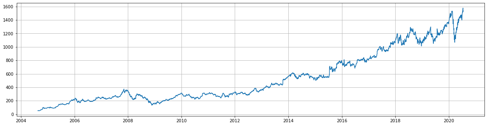
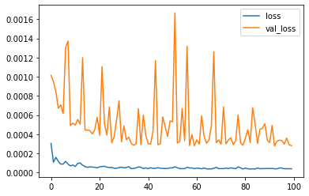
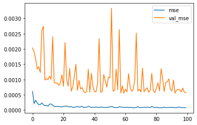
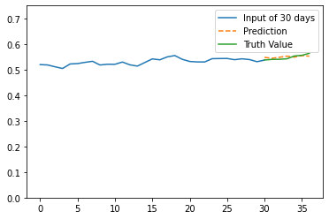
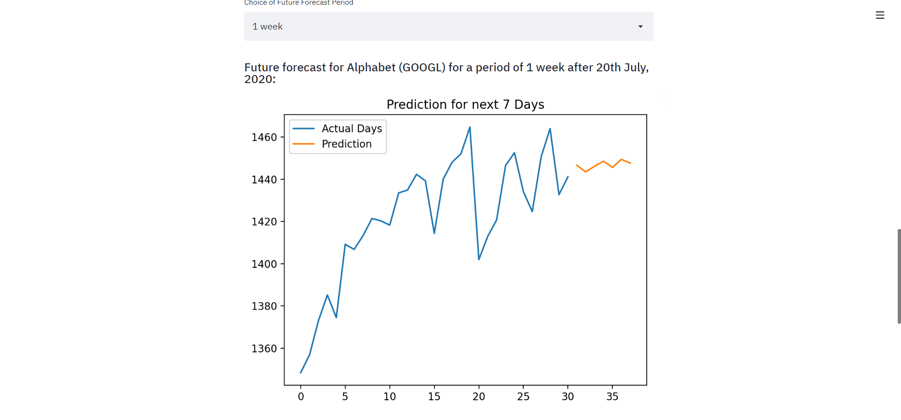
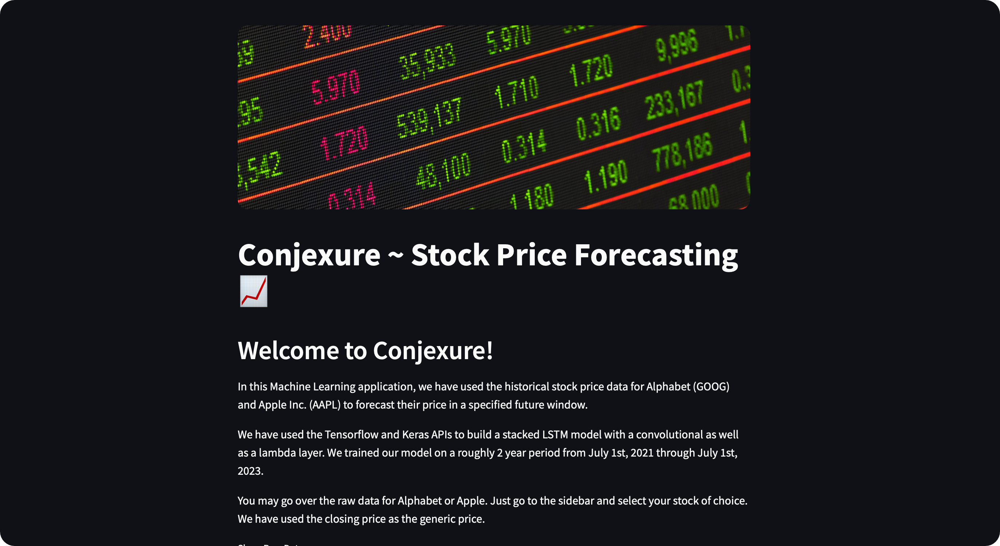
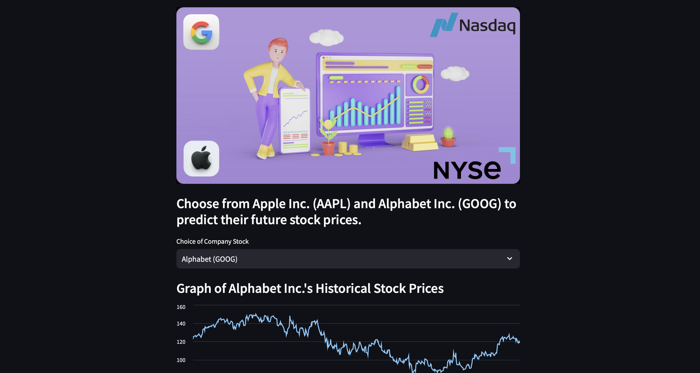
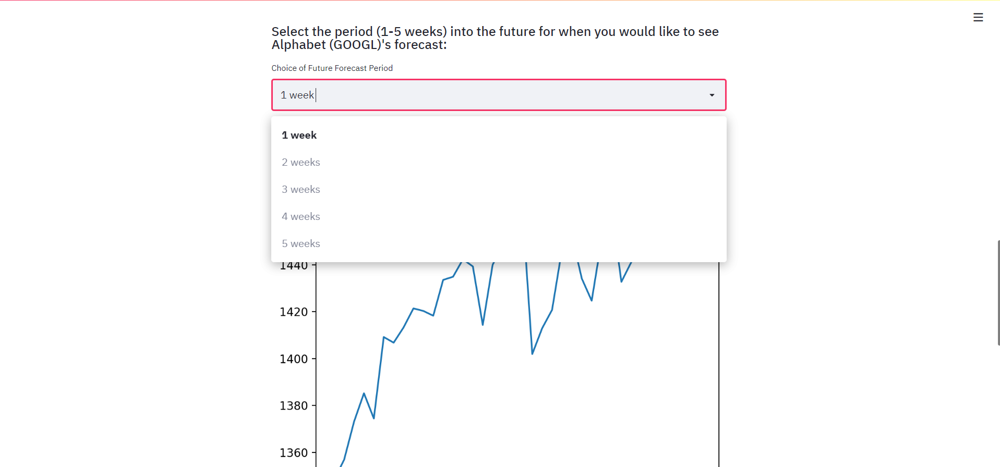


# Conjexure

Conjexure is a machine learning web app for forecasting the stock prices of certain companies into the future. Stock prediction using machine learning is one of the ho topic. In stock prediction model we basically train a model using reccurent neural networks such as an Long Short Term Memory Model. We use RNNs as they were designed to work with sequence prediction problems. Sequence prediction problems come in many forms and are best described by the types of inputs and outputs supported. LSTM is a type of RNN which is good at handling long term dependecies which is benifitable to us in predicting stock prices based on last 30 or 60 days for further 7-14 days.

## Description
Conjexure utilizes the stock prices for Alphabet Inc. (GOOGL) and Apple Inc (AAPL) for training. The reason behind this is as there closing stock price graph over the time period is quite smooth if seen overall and avoids any sudden jumps or falls and follows a upward trend. We can forecast into a user-specified future window of 1-5 weeks. We leave this upto user to select the period of time he/she wants to predict the stock values for. It also displays the raw data for the user to inspect. For the stock price, the closing price of a stock on any given day is chosen.

The technical stack we have used is as follows: <br/>
- Tensorflow(Keras)    &nbsp;&nbsp;&nbsp;&nbsp;&nbsp;        Building Model<br/>
- Pandas data reader     &nbsp;&nbsp;       Collecting stock data of the companies<br/>
- Matplotlib            &nbsp;&nbsp;&nbsp;&nbsp;&nbsp;&nbsp;&nbsp;&nbsp;&nbsp;&nbsp;&nbsp;&nbsp;&nbsp;&nbsp;&nbsp;&nbsp;       Visualization and Plotting graphs<br/>
- Streamlit             &nbsp;&nbsp;&nbsp;&nbsp;&nbsp;&nbsp;&nbsp;&nbsp;&nbsp;&nbsp;&nbsp;&nbsp;&nbsp;&nbsp;&nbsp;&nbsp;&nbsp;&nbsp;    Model Deployment<br/>

For deployment of Conjexure as an interactive web app, the [Streamlit](https://www.streamlit.io) framework was chosen for its robustness and ease of scripting.
You may go through the documentation for Streamlit [here.](https://docs.streamlit.io/en/stable/)

Let's visualize the stock prices value for Alphabet Inc. (GOOGL)


As you can see from the above graph that it follows a upward trend overall. These are the stock values of Alphabet Inc. from 1st of April 2003 to 15th July 2020.
## Getting Started

To play around with Conjexure yourself, head on to our web app at https://conjexure.herokuapp.com.

### Running on a local machine
#### Prerequisites

To run Conjexure on your local machine, first ensure that the following relevant dependencies are installed.

1. [Pandas_datareader](https://pandas-datareader.readthedocs.io/en/latest/)
2. [Pandas](https://pandas.pydata.org)
3. [NumPy](numpy.org)
4. [Matplotlib.pyplot](https://matplotlib.org/api/pyplot_api.html)

To install Streamlit, use the given pip command.
```bash
pip install streamlit
```
### Running 
Download the zip file from our repository and unzip into the desired directory.

Running Streamlit scripts is amazingly easy. All you need to do is enter the following line in your terminal.

```bash
streamlit run stockpricepred.py
```

## Machine Learning Architecture

Conjexure uses the Tensorflow and Keras libraries to build 5 stacked LSTM models complemented by a convolutional as well as a lambda layer.

There are 5 models to forecast into 5 different future windows (from 1-5 weeks) depending on user specification. Each model utilizes a proportionately larger training set to compensate for the increasing prediction window. For example, the model to forecast one week into the future uses the last 30 days of stock price data, the model to forecast two weeks uses the last 60 days of data and so on.

For any stock symbol, up to 5 different price metrics are available, including the opening price, the closing price, the high, the low, etc. Conjexure uses the closing price as the standard stock price. We came to this decision because the closing price accounts for news related to the company and the market's general mood on the day (which can then be predicted by our model).

Model that we have used for deployment have following architecture:
Model: "sequential"
_________________________________________________________________ <br/>
Layer (type)  &nbsp;&nbsp;&nbsp;&nbsp;&nbsp;&nbsp;&nbsp;&nbsp;&nbsp;&nbsp; &nbsp;&nbsp;&nbsp;&nbsp;&nbsp;              Output Shape   &nbsp;&nbsp;&nbsp;&nbsp;&nbsp;&nbsp;&nbsp;&nbsp;&nbsp;&nbsp;&nbsp;&nbsp;&nbsp;&nbsp;&nbsp;           Param #   <br/>
=================================================================<br/>
conv1d (Conv1D)  &nbsp;&nbsp;&nbsp;&nbsp;&nbsp;&nbsp;&nbsp;&nbsp;&nbsp;&nbsp;             (None, None, 128)   &nbsp;&nbsp;&nbsp;&nbsp;&nbsp;&nbsp;&nbsp;&nbsp;&nbsp;&nbsp;       768       <br/>
_________________________________________________________________<br/>
lstm (LSTM)      &nbsp;&nbsp;&nbsp;&nbsp;&nbsp;&nbsp;&nbsp;&nbsp;&nbsp;&nbsp;             (None, None, 128)    &nbsp;&nbsp;&nbsp;&nbsp;&nbsp;&nbsp;&nbsp;&nbsp;&nbsp;&nbsp;      131584    <br/>
_________________________________________________________________<br/>
lstm_1 (LSTM)      &nbsp;&nbsp;&nbsp;&nbsp;&nbsp;&nbsp;&nbsp;&nbsp;&nbsp;&nbsp;           (None, None, 128)    &nbsp;&nbsp;&nbsp;&nbsp;&nbsp;&nbsp;&nbsp;&nbsp;&nbsp;&nbsp;      131584    <br/>
_________________________________________________________________<br/>
lstm_2 (LSTM)     &nbsp;&nbsp;&nbsp;&nbsp;&nbsp;&nbsp;&nbsp;&nbsp;&nbsp;&nbsp;            (None, 128)         &nbsp;&nbsp;&nbsp;&nbsp;&nbsp;&nbsp;&nbsp;&nbsp;&nbsp;&nbsp;       131584    <br/>
_________________________________________________________________<br/>
dense (Dense)      &nbsp;&nbsp;&nbsp;&nbsp;&nbsp;&nbsp;&nbsp;&nbsp;&nbsp;&nbsp;           (None, 64)     &nbsp;&nbsp;&nbsp;&nbsp;&nbsp;&nbsp;&nbsp;&nbsp;&nbsp;&nbsp;            8256      <br/>
_________________________________________________________________<br/>
dense_1 (Dense)      &nbsp;&nbsp;&nbsp;&nbsp;&nbsp;&nbsp;&nbsp;&nbsp;&nbsp;&nbsp;         (None, 64)        &nbsp;&nbsp;&nbsp;&nbsp;&nbsp;&nbsp;&nbsp;&nbsp;&nbsp;&nbsp;         4160      <br/>
_________________________________________________________________<br/>
dense_2 (Dense)    &nbsp;&nbsp;&nbsp;&nbsp;&nbsp;&nbsp;&nbsp;&nbsp;&nbsp;&nbsp;           (None, 7)        &nbsp;&nbsp;&nbsp;&nbsp;&nbsp;&nbsp;&nbsp;&nbsp;&nbsp;&nbsp;          455       <br/>
=================================================================<br/>
Total params: 408,391<br/>
Trainable params: 408,391<br/>
Non-trainable params: 0<br/>
_________________________________________________________________
The above model is for forecasting 7 days stock values. In the other models just the output shape is altered which is (None, 14) for two weeks, (None, 21) for three weeks and so on.

## Model Loss
The following is the validation and training loss os the above model.<br/>
<br/>


From above we can see that our validation loss is noisy this might be due to the fact that we are using stochastic gradient descent which calculate loss based on each sample. But if you look at the y axis values which represent the loss value You will see that out loss value is almost in 10^(-3) which is pretty low loss so even if it's noisy it's quite low so it does not effect our model performance.
Following is the mean squarred error graph:<br/><br/>
The above statement regarding the validation loss can be proved by the above mean squarred error plot of validation data.

## Visualization over validation data
Our model gives great performace in predicting future validation set values and the same can be seen from the plot below: <br/>
<br/>
We are using past 30 days stock values to predict next 7 days values. For this purpose each of the 7 days value is diretly dependent on the 30 days stock values and not on the values of the day just before them. As we are directly outputting 7 days stock values without considering the stock values of t-1 day for t day.

## Forecast Graph
Below is the forecast of the stock values for 21st July 2020 to 27th July 2020 based on the data of past 98 days.<br/>
<br/>

## Webapp 
<br/>

<br/>

<br/>


## Team 
- [Aditya mangla](https://www.linkedin.com/in/aadimangla)
- Harsh Sharma
- Abhishek Saxena
- Tarushi Pathak
- Aditya Shukla
- Sheel Patel
- Ankita Kokkera
## Contributing
Pull requests are welcome. For major changes, please open an issue first to discuss what you would like to change.
